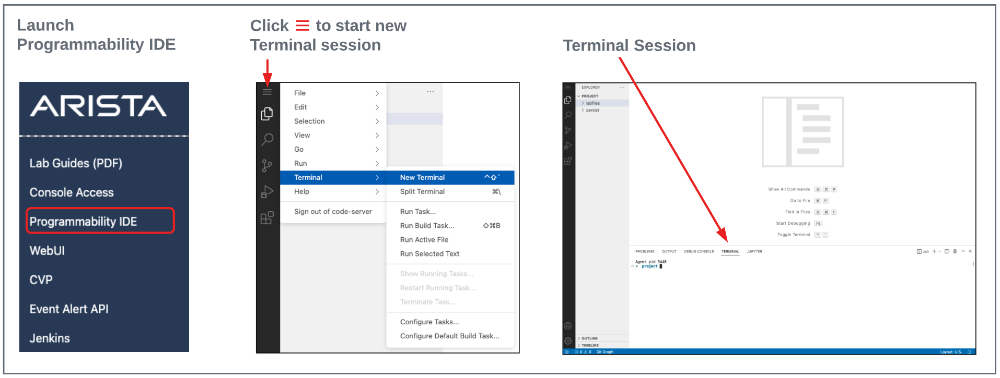

# AVD와 CVP를 이용한 EVPN VXLAN 기반 L3LS 배포
이 저장소는 실제 구축 사례가 아닌 **교육용 실습 자료**로, Arista의 AVD 자동화 프레임워크를 사용하여 듀얼 데이터센터, Layer 3 leaf-spine EVPN VXLAN 패브릭을 직접 배포해보며 익힐 수 있도록 구성되어 있습니다. 또한 설정 변경 관리 및 감사(auditing)를 위해 CI/CD 파이프라인에 CVP를 통합하는 방법도 함께 다룹니다. **eos_config** 롤을 이용한 ansible 플레이북으로 배포하는 정적(static) 설정을 가진 장비들과, AVD를 이용해 직접 수정하고 구현해야 하는 장비들이 함께 포함되어 있습니다.

***참고:*** 이 실습 자료는 AVD 6.3.0 버전을 기준으로 작성되었습니다.

## 데이터센터 패브릭 토폴로지
아래는 여러분이 다룰 데이터센터 토폴로지의 네트워크 다이어그램입니다. 이 토폴로지에서 모든 `s1` 장비는 `sites/dc1`에 해당하고, 모든 `s2` 장비는 `sites/dc2`에 해당합니다.


## 디렉토리 구조 및 구성
이 토폴로지는 두 개의 데이터센터를 다루기 때문에, vars 및 inventory 디렉토리/파일은 데이터센터별로 분리되어 있습니다. 즉, 데이터센터마다 별도의 inventory 파일과 group_vars 디렉토리가 존재합니다. 또한 두 데이터센터에 공통으로 적용되는 항목들은 global_vars 디렉토리와 파일에 정리되어 있습니다. 마지막으로, 빌드 및 배포용 플레이북 역시 데이터센터별로 분리되어 있습니다. 아래 트리 구조는 이러한 항목들을 정리한 것입니다:

### 디렉토리 및 파일 구조
```bash
|---global_vars
    |---global_dc_vars.yml
|---lab guide
    |---evpn-vxlan-labs.md
    |---multi-domain-evpn-vxlan-guide.md
|---playbooks
    |---build_dc1.yml
    |---build_dc2.yml
    |---deploy_dc1_cvp.yml
    |---deploy_dc1_dci_eapi.yml
    |---deploy_dc1_eapi.yml
    |---deploy_dc1_host_cvp.yml
    |---deploy_dc2_cvp.yml
    |---deploy_dc2_dci_eapi.yml
    |---deploy_dc2_eapi.yml
    |---deploy_dc2_host_cvp.yml
|---sites
    |---dc1 [DC1 전용 Inventory 및 VARs]
    |   |---dci_configs [토폴로지용 Non-AVD 설정]
    |   |   |---s1-core1.cfg
    |   |   |---s1-core2.cfg
    |   |---host_configs [토폴로지용 Non-AVD 설정]
    |   |   |---s1-host1.cfg
    |   |   |---s1-host2.cfg
    |   |---groups_vars
    |   |   |---dc1_fabric_ports.yml
    |   |   |---dc1_fabric_services.yml
    |   |   |---dc1_fabric.yml
    |   |   |---dc1_hosts.yml
    |   |   |---dc1_leafs.yml
    |   |   |---dc1_spines.yml
    |   |   |---dc1.yml
    |   |---inventory.yml
    |---dc2 [DC2 전용 Inventory 및 VARs]
    |   |---dci_configs [토폴로지용 Non-AVD 설정]
    |   |   |---s2-core1.cfg
    |   |   |---s2-core2.cfg
    |   |---host_configs [토폴로지용 Non-AVD 설정]
    |   |   |---s2-host1.cfg
    |   |   |---s2-host2.cfg
    |   |---groups_vars
    |   |   |---dc2_fabric_ports.yml
    |   |   |---dc2_fabric_services.yml
    |   |   |---dc2_fabric.yml
    |   |   |---dc2_hosts.yml
    |   |   |---dc2_leafs.yml
    |   |   |---dc2_spines.yml
    |   |   |---dc2.yml
    |   |---inventory.yml
|---ansible.cfg
|---Makefile
|---README.md
```

# ATD 프로그래머빌리티 IDE에서 AVD 실행하기
ATD 환경에서 프로그래머빌리티 IDE를 실행하고, 비밀번호를 입력한 뒤 새 터미널을 엽니다:



## STEP #1 - AVD 렌더링/검증에 필요한 Python 패키지 설치

- 터미널 세션에서 아래 명령어를 실행합니다. AVD 6.x는 `pyavd`를 통해 설정을 렌더링하며, ANTA 테스트 실행에 필요한 `anta`와 관련 의존성 패키지(`pyavd-utils`, `python-socks`, `distlib`)까지 함께 설치합니다. 이 패키지들은 ansible collection과 별도로 설치해야 합니다.

``` bash
python3 -m pip install --upgrade \
  "pyavd==6.3.0" \
  "pyavd-utils==0.0.6" \
  "python-socks[asyncio]>=2.7.2" \
  "anta==1.8.0" \
  "distlib>=0.3.9"
```

## STEP #2 - 필요한 저장소 클론

- 작업 디렉토리를 변경합니다. 이후 명령어들은 이 위치에서 실행됩니다.

``` bash
cd labfiles
```

- AVD 6.3.0 collection을 설치합니다

``` bash
ansible-galaxy collection install arista.avd:==6.3.0
```

- 실습 저장소를 클론합니다

``` bash
git clone https://github.com/youwins-lab/atd_avd_l3_dc.git
```

- 이 시점에서 labfiles 디렉토리 아래에 `atd_avd_l3_dc` 디렉토리가 보여야 합니다.

### STEP #3 - 랩 비밀번호 환경 변수 설정

각 랩에는 고유한 비밀번호가 부여됩니다. 아래 명령어로 `LABPASSPHRASE`라는 환경 변수를 설정합니다. 이 변수는 이후 로컬 사용자 비밀번호를 생성하고, 스위치에 접속하여 설정을 푸시하는 데 사용됩니다.

``` bash
export LABPASSPHRASE=`cat /home/coder/.config/code-server/config.yaml| grep "password:" | awk '{print $2}'`
```

비밀번호가 설정되었는지 확인할 수 있습니다. 이는 랩에 접속하기 위해 링크를 클릭했을 때 표시된 비밀번호와 동일합니다.

``` bash
echo $LABPASSPHRASE
```

`dc1.yml`과 `dc2.yml`에는 실제 랩 자격 증명이 저장소에 커밋되지 않도록 `ansible_password: "###########"`가 플레이스홀더로 들어 있습니다. `sed`를 사용하여 두 파일에 `LABPASSPHRASE`를 그대로 치환해 넣습니다:

``` bash
sed -i "s/^ansible_password:.*/ansible_password: ${LABPASSPHRASE}/" \
sites/dc1/group_vars/dc1.yml \
sites/dc2/group_vars/dc2.yml
```

이 명령어는 각 파일에서 `ansible_password:` 줄을 찾아 실제 랩 비밀번호로 교체하며, ansible은 이후 이 값을 이용해 eAPI를 통해 EOS 스위치 및 CVP에 인증합니다.

### STEP #4 - 실제 저장소 디렉토리로 이동
``` bash
cd atd_avd_l3_dc
```

## STEP #5 - Claude Code 설치 및 사용

이 랩의 설정 작업(그룹 변수 작성, 인벤토리 구성, 플레이북 실행 결과 확인 등)은 Claude Code를 이용해 진행할 수 있습니다. 아래 명령어로 설치합니다.

``` bash
curl -fsSL https://claude.ai/install.sh | bash
```

설치가 끝나면 저장소 루트 디렉토리(`atd_avd_l3_dc`)에서 아래 명령어로 실행합니다.

``` bash
claude
```

실행되면 대화형 세션이 시작되며, 이 디렉토리 안의 파일들을 읽고 수정하거나, `make` 명령어와 ansible 플레이북을 대신 실행시키는 등의 작업을 자연어로 요청할 수 있습니다. 세션을 종료하려면 `exit`를 입력하거나 `Ctrl+C`를 두 번 누르면 됩니다.

## 설정 빌드/배포 및 랩 안내

<br>

이 AVD 토폴로지에는 EVPN VXLAN 패브릭에서 AVD를 이용한 Day 2 운영을 보여주는 작업들로 구성된 두 개의 랩이 포함되어 있습니다. 이 랩들은 **lab guide** 디렉토리의 `evpn-vxlan-labs.md` 파일에 있습니다. IDE 안에서 해당 랩 파일을 마우스 우클릭한 뒤 **Open Preview**를 클릭하면 읽기 좋은 MarkDown 형식으로 볼 수 있습니다. github에서 직접 볼 수도 있습니다.

이 토폴로지가 왜/어떻게 두 데이터센터를 하나의 EVPN/VXLAN 도메인처럼 보이게 만드는지(EVPN Gateway, DCI, 실제 IP 주소 체계 등)를 개념부터 이해하고 싶다면 **lab guide** 디렉토리의 `multi-domain-evpn-vxlan-guide.md`를 참고하세요.

이 랩들을 진행하기 전에, 위에서 설명한 대로 `ansible_password`를 수정한 다음 초기 데이터센터 패브릭을 배포해야 합니다. 패브릭의 초기 배포와 이후 모든 변경 사항의 배포는 알맞은 site inventory 파일을 대상으로 해당 ansible 플레이북을 실행하는 방식으로 이루어집니다. 이 과정을 쉽게 하기 위해, 포함된 Makefile을 통해 축약된 `make command`로 올바른 ansible 플레이북을 올바른 inventory 파일에 대해 실행할 수 있는 alias 명령어들을 제공합니다.

아래는 사용 가능한 모든 make 명령어와 각각의 목적, 그리고 어떤 ansible 플레이북과 inventory 파일을 사용하는지에 대한 설명입니다.

<br>

**명령어:**  `make deploy_dc1_dci`

```bash
deploy_dc1_dci: ## Deploy DC1 DCI configs to non-avd devices
	ansible-playbook playbooks/deploy_dc1_dci_eapi.yml -i sites/dc1/inventory.yml
```
**호출되는 플레이북:**  `deploy_dc1_dci_eapi.yml`

**Inventory 파일:**  `dc1/inventory.yml`

**설명:** 이 명령어는 데이터센터1의 s1-core1, s1-core2 장비에 인터페이스 및 BGP 설정 변경 사항을 배포합니다. 이는 두 데이터센터 패브릭 간 라우팅을 활성화하기 위해 필요합니다. 이 플레이북은 eos_config 모듈을 사용하여 eAPI를 통해 장비에 설정 변경 사항을 merge합니다.

<br>
<br>

**명령어:**  `make deploy_dc2_dci`

```bash
deploy_dc2_dci: ## Deploy DC2 DCI configs to non-avd devices
	ansible-playbook playbooks/deploy_dc2_dci_eapi.yml -i sites/dc2/inventory.yml
```
**호출되는 플레이북:**  `deploy_dc2_dci_eapi.yml`

**Inventory 파일:**  `dc2/inventory.yml`

**설명:** 이 명령어는 데이터센터2의 s2-core1, s2-core2 장비에 인터페이스 및 BGP 설정 변경 사항을 배포합니다. 이는 두 데이터센터 패브릭 간 라우팅을 활성화하기 위해 필요합니다. 이 플레이북은 eos_config 모듈을 사용하여 eAPI를 통해 장비에 설정 변경 사항을 merge합니다.

<br>
<br>

**명령어:**  `make deploy_dc1_dci_cvp`

```bash
deploy_dc1_dci_cvp: ## Deploy DC1 DCI configs to non-avd devices through CVP
	ansible-playbook playbooks/deploy_dc1_dci_cvp.yml -i sites/dc1/inventory.yml
```
**호출되는 플레이북:**  `deploy_dc1_dci_cvp.yml`

**Inventory 파일:**  `dc1/inventory.yml`

**설명:** 동일한 s1-core1, s1-core2 장비를 대상으로 하는 `make deploy_dc1_dci`의 CVP 기반 대안입니다. 이 장비들은 eos_designs/eos_cli_config_gen으로 빌드되지 않기 때문에, 이 플레이북은 AVD structured config 대신 `sites/dc1/dci_configs`에서 정적 설정을, Ansible vars에서 태그를 직접 읽어들인 뒤 `arista.avd.cv_deploy` 롤을 통해 CVP에 configlet 형태로 업로드합니다. 이 플레이북은 `cv_run_change_control: true`로 설정되어 있어, 별도의 사용자 개입 없이 CVP가 자동으로 change control을 생성하고 **실행**합니다.

<br>
<br>

**명령어:**  `make deploy_dc2_dci_cvp`

```bash
deploy_dc2_dci_cvp: ## Deploy DC2 DCI configs to non-avd devices through CVP
	ansible-playbook playbooks/deploy_dc2_dci_cvp.yml -i sites/dc2/inventory.yml
```
**호출되는 플레이북:**  `deploy_dc2_dci_cvp.yml`

**Inventory 파일:**  `dc2/inventory.yml`

**설명:** 동일한 s2-core1, s2-core2 장비를 대상으로 하며, `make deploy_dc1_dci_cvp`와 동일한 `arista.avd.cv_deploy` 방식을 사용하는 `make deploy_dc2_dci`의 CVP 기반 대안입니다. DC1 버전과 달리 이 플레이북은 `cv_run_change_control: false`로 설정되어 있어, CVP가 configlet은 업로드하지만 change control을 자동으로 생성/실행하지는 **않습니다** — CVP UI에서 직접 생성하고 승인해야 합니다.

<br>
<br>

**명령어:**  `make deploy_dc1_host_cvp`

```bash
deploy_dc1_host_cvp: ## Deploy DC1 s1-host1/host2 configs to non-avd devices through CVP
	ansible-playbook playbooks/deploy_dc1_host_cvp.yml -i sites/dc1/inventory.yml
```
**호출되는 플레이북:**  `deploy_dc1_host_cvp.yml`

**Inventory 파일:**  `dc1/inventory.yml`

**설명:** 각각 LeafPair1(s1-leaf1/s1-leaf2)과 LeafPair2(s1-leaf3/s1-leaf4)에 MLAG port-channel로 이중 연결(dual-homed)된 서버 엔드포인트인 s1-host1, s1-host2의 정적 설정을 배포합니다. DCI 장비와 마찬가지로 이 장비들도 eos_designs/eos_cli_config_gen으로 빌드되지 않으며, 정적 설정은 `sites/dc1/host_configs`에 있고 `arista.avd.cv_deploy` 롤을 통해 CVP에 configlet으로 업로드됩니다. `cv_run_change_control: true`로 설정되어 있어 change control이 자동으로 생성 및 실행됩니다. 각 호스트는 자신의 leaf pair로 VLAN 10/20을 트렁크하는 Port-Channel1(LACP active)과, leaf의 anycast 게이트웨이(10.10.10.1/10.20.20.1) 및 EVPN-VXLAN 구간 너머의 DC2 호스트로 ping 테스트를 할 수 있도록 테스트용 IP 주소가 설정된 Vlan10/Vlan20 SVI로 구성됩니다.

<br>
<br>

**명령어:**  `make deploy_dc2_host_cvp`

```bash
deploy_dc2_host_cvp: ## Deploy DC2 s2-host1/host2 configs to non-avd devices through CVP
	ansible-playbook playbooks/deploy_dc2_host_cvp.yml -i sites/dc2/inventory.yml
```
**호출되는 플레이북:**  `deploy_dc2_host_cvp.yml`

**Inventory 파일:**  `dc2/inventory.yml`

**설명:** `make deploy_dc1_host_cvp`의 DC2 버전으로, 동일한 `arista.avd.cv_deploy` 방식을 통해 `sites/dc2/host_configs`에 있는 s2-host1, s2-host2(DC2의 LeafPair1, LeafPair2에 각각 이중 연결)의 정적 설정을 배포합니다.

<br>
<br>

**명령어:**  `make build_dc1`

```bash
build_dc1: ## Build AVD Configs for DC1
	ansible-playbook playbooks/build_dc1.yml -i sites/dc1/inventory.yml
```
**호출되는 플레이북:**  `build_dc1.yml`

**Inventory 파일:**  `dc1/inventory.yml`

**설명:** 이 명령어는 AVD를 호출하여 데이터센터1의 모든 장비에 대한 설정을 빌드합니다. 이 플레이북은 global_vars 파일의 변수들과, site/dc1의 group_vars 디렉토리에 있는 다양한 yml 파일에 정의된 모든 내용을 읽어들입니다. 그런 다음 `site1` 디렉토리 아래에 `intended/configs`, `intended/structured_configs`, `documentation` 디렉토리를 생성합니다. 마지막으로 모든 장비의 설정, structured config, 마크다운 문서 파일을 생성합니다.

<br>
<br>

**명령어:**  `make build_dc2`

```bash
build_dc2: ## Build AVD Configs for DC2
	ansible-playbook playbooks/build_dc2.yml -i sites/dc2/inventory.yml
```
**호출되는 플레이북:**  `build_dc2.yml`

**Inventory 파일:**  `dc2/inventory.yml`

**설명:** 이 명령어는 AVD를 호출하여 데이터센터2의 모든 장비에 대한 설정을 빌드합니다. 이 플레이북은 global_vars 파일의 변수들과, site/dc2의 group_vars 디렉토리에 있는 다양한 yml 파일에 정의된 모든 내용을 읽어들입니다. 그런 다음 `site2` 디렉토리 아래에 `intended/configs`, `intended/structured_configs`, `documentation` 디렉토리를 생성합니다. 마지막으로 모든 장비의 설정, structured config, 마크다운 문서 파일을 생성합니다.

<br>
<br>

**명령어:**  `make deploy_dc1_cvp`

```bash
deploy_dc1_cvp: ## Deploy DC1 AVD Configs Through CVP
	ansible-playbook playbooks/deploy_dc1_cvp.yml -i sites/dc1/inventory.yml
```
**호출되는 플레이북:**  `deploy_dc1_cvp.yml`

**Inventory 파일:**  `dc1/inventory.yml`

**설명:** 이 명령어는 AVD를 호출하여 생성된 설정을 배포하고, 필요한 경우 CVP의 컨테이너 구조를 변경합니다. 이 플레이북은 deploy_cvp 롤을 호출하여 필요 시 CVP 컨테이너 구조를 수정하고, 생성된 설정을 CVP에 configlet 형태로 업로드한 뒤, 데이터센터1의 관련 장비에 해당 configlet을 배포합니다. 이 플레이북에는 `execute_tasks: true` 플래그가 있어, 생성된 작업(task)에 대한 change control을 CVP가 자동으로 생성하고 사용자 개입 없이 실행하도록 합니다.

<br>
<br>

**명령어:**  `make deploy_dc2_cvp`

```bash
deploy_dc1_cvp: ## Deploy DC2 AVD Configs Through CVP
	ansible-playbook playbooks/deploy_dc2_cvp.yml -i sites/dc2/inventory.yml
```
**호출되는 플레이북:**  `deploy_dc2_cvp.yml`

**Inventory 파일:**  `dc2/inventory.yml`

**설명:** 이 명령어는 AVD를 호출하여 생성된 설정을 배포하고, 필요한 경우 CVP의 컨테이너 구조를 변경합니다. 이 플레이북은 deploy_cvp 롤을 호출하여 필요 시 CVP 컨테이너 구조를 수정하고, 생성된 설정을 CVP에 configlet 형태로 업로드한 뒤, 데이터센터2의 관련 장비에 해당 configlet을 배포합니다. 이 플레이북에는 `execute_tasks: true` 플래그가 있어, 생성된 작업(task)에 대한 change control을 CVP가 자동으로 생성하고 사용자 개입 없이 실행하도록 합니다.

<br>
<br>

**명령어:**  `make deploy_dc1_eapi`

```bash
deploy_dc1_eapi: ## Deploy DC1 Spine/Leaf AVD generated configs via eAPI
	ansible-playbook playbooks/deploy_dc1_eapi.yml -i sites/dc1/inventory.yml
```
**호출되는 플레이북:**  `deploy_dc1_eapi.yml`

**Inventory 파일:**  `dc1/inventory.yml`

**설명:** 이 명령어는 eos_config 모듈을 호출하여 CVP를 거치지 않고 장비의 eAPI를 직접 사용해 데이터센터1의 해당 장비에만 생성된 설정을 배포합니다. 이 플레이북은 CVP 없이 자동화와 AVD를 사용해 설정을 관리하는 또 다른 방법을 보여줍니다.

<br>
<br>

**명령어:**  `make deploy_dc2_eapi`

```bash
deploy_dc1_eapi: ## Deploy DC2 Spine/Leaf AVD generated configs via eAPI
	ansible-playbook playbooks/deploy_dc2_eapi.yml -i sites/dc2/inventory.yml
```
**호출되는 플레이북:**  `deploy_dc2_eapi.yml`

**Inventory 파일:**  `dc2/inventory.yml`

**설명:** 이 명령어는 eos_config 모듈을 호출하여 CVP를 거치지 않고 장비의 eAPI를 직접 사용해 데이터센터2의 해당 장비에만 생성된 설정을 배포합니다. 이 플레이북은 CVP 없이 자동화와 AVD를 사용해 설정을 관리하는 또 다른 방법을 보여줍니다.

<br>
<br>

### 초기 설정 빌드 및 배포

AVD를 이용해 초기 패브릭을 빌드하기 위해 아래 순서대로 make 명령어를 실행하세요.

1) dc1 DCI 설정 배포:  `make deploy_dc1_dci`
2) dc2 DCI 설정 배포:  `make deploy_dc2_dci`
3) dc1 설정 빌드:  `make build_dc1`
4) dc2 설정 빌드:  `make build_dc2`
5) CVP를 통해 dc1 설정 배포:  `make deploy_dc1_cvp`
    1) CVP에 로그인하여 task 및 change control 화면에서 작업이 자동으로 생성되고 실행되는 것을 확인합니다.
6) CVP를 통해 dc2 설정 배포:  `make deploy_dc2_cvp`
    1) CVP에 로그인하여 task 및 change control 화면에서 작업이 자동으로 생성되고 실행되는 것을 확인합니다.
7) CVP를 통해 dc1 host 설정 배포:  `make deploy_dc1_host_cvp`
8) CVP를 통해 dc2 host 설정 배포:  `make deploy_dc2_host_cvp`
9) 스위치 CLI에 로그인하여 설정과 동작을 확인합니다.
10) `lab guide` 디렉토리의 랩을 계속 진행합니다.
